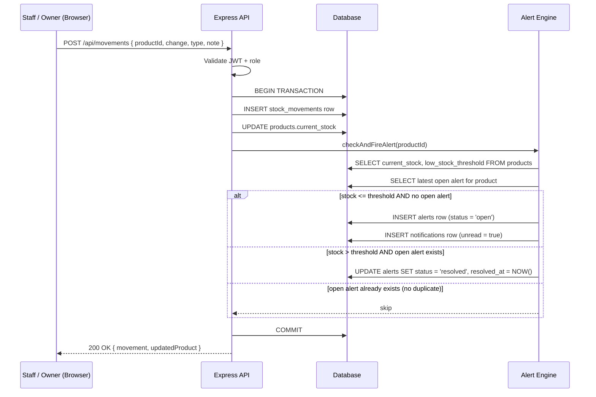
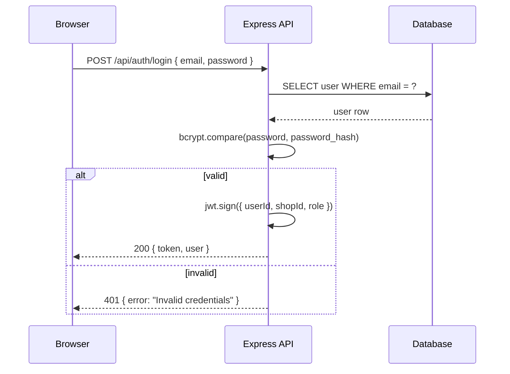

# Design Document: INVENTRACK — Inventory + Low-Stock Alert System

## Overview

INVENTRACK is a web-based inventory management system built for small shop owners (grocery, hardware, pharmacy, boutique). It replaces manual notebook/spreadsheet tracking with a clean, fast, and mobile-responsive app that automatically flags low-stock items, logs every stock change, and suggests reorder quantities based on real sales velocity.

The system supports two roles — Shop Owner and Staff Member — and is architected as a React + Vite frontend talking to a Node.js/Express REST API, backed by SQLite for local development with a schema designed to migrate to PostgreSQL with minimal effort. Notifications are delivered in-app via a bell icon with unread count; email notifications (via Resend or Nodemailer) are scoped as a stretch goal.

**Technology choices explained for beginners:**
- **Express over FastAPI**: Both are excellent. Express is chosen here because your frontend is React (JavaScript/TypeScript) and your team likely shares JS knowledge. Using Node.js on the backend means one language across the stack, which is simpler to maintain. FastAPI (Python) is faster to write and has great automatic docs, but adds a second language to learn and deploy. If you ever hire a Python-focused developer or need heavy data processing, FastAPI is worth revisiting.
- **SQLite → PostgreSQL**: SQLite stores your entire database as a single file on disk — zero setup, perfect for local dev and a single-server deployment on Render or Railway. The catch: it doesn't handle multiple simultaneous writes well, so once you have more than one server process or heavy concurrent traffic, you'll want PostgreSQL. The schema below is written to be compatible with both; migrating later is a one-command change in most ORM tools.


---

## Architecture

```mermaid
graph TD
    subgraph Client["Browser / Mobile Browser"]
        UI[React + Vite SPA]
        UI --> AuthCtx[Auth Context / JWT]
        UI --> Pages[Pages: Dashboard, Inventory, Alerts, Reports, Settings]
        UI --> NotifBell[Notification Bell Component]
    end

    subgraph API["Node.js / Express API Server"]
        Router[Express Router]
        Router --> AuthMW[JWT Auth Middleware]
        AuthMW --> AuthRoutes[/api/auth]
        AuthMW --> ProductRoutes[/api/products]
        AuthMW --> MovementRoutes[/api/movements]
        AuthMW --> AlertRoutes[/api/alerts]
        AuthMW --> NotifRoutes[/api/notifications]
        AuthMW --> DashRoutes[/api/dashboard]
        AuthMW --> UserRoutes[/api/users]

        AlertEngine[Alert Engine\n- runs on stock change\n- deduplicates alerts]
        ReorderEngine[Reorder Engine\n- calculates velocity\n- suggests qty]
        
        ProductRoutes --> AlertEngine
        MovementRoutes --> AlertEngine
        AlertEngine --> ReorderEngine
    end

    subgraph DB["Database (SQLite / PostgreSQL)"]
        Users[(users)]
        Shops[(shops)]
        Products[(products)]
        StockMovements[(stock_movements)]
        Alerts[(alerts)]
        Notifications[(notifications)]
    end

    UI -->|HTTPS REST JSON| Router
    Router --> DB
    AlertEngine --> DB
    ReorderEngine --> DB
```


## Sequence Diagrams

### Stock Adjustment Flow (with Alert Trigger)



### Login Flow




---

## Components and Interfaces

### Backend: Express Route Handlers

**Auth Routes** (`/api/auth`)

```typescript
interface AuthController {
  // POST /api/auth/register
  register(req: { body: { name: string; email: string; password: string; shopName: string } }): Promise<{ token: string; user: UserPublic }>

  // POST /api/auth/login
  login(req: { body: { email: string; password: string } }): Promise<{ token: string; user: UserPublic }>
}
```

**Product Routes** (`/api/products`)

```typescript
interface ProductController {
  // GET /api/products?search=&category=&sortBy=&order=&page=&limit=
  list(req: AuthedRequest & { query: ProductListQuery }): Promise<PaginatedResponse<Product>>

  // POST /api/products
  create(req: AuthedRequest & { body: CreateProductInput }): Promise<Product>

  // GET /api/products/:id
  getOne(req: AuthedRequest & { params: { id: string } }): Promise<Product>

  // PATCH /api/products/:id
  update(req: AuthedRequest & { params: { id: string }; body: UpdateProductInput }): Promise<Product>

  // DELETE /api/products/:id  (soft delete — sets is_archived = true)
  archive(req: AuthedRequest & { params: { id: string } }): Promise<{ success: boolean }>
}
```

**Stock Movement Routes** (`/api/movements`)

```typescript
interface MovementController {
  // POST /api/movements
  create(req: AuthedRequest & { body: CreateMovementInput }): Promise<{ movement: StockMovement; updatedProduct: Product }>

  // GET /api/movements?productId=&limit=&before=
  list(req: AuthedRequest & { query: MovementListQuery }): Promise<StockMovement[]>
}
```

**Alert Routes** (`/api/alerts`)

```typescript
interface AlertController {
  // GET /api/alerts?status=open|resolved&page=&limit=
  list(req: AuthedRequest & { query: AlertListQuery }): Promise<PaginatedResponse<AlertWithProduct>>

  // PATCH /api/alerts/:id  { status: 'ordered' | 'dismissed' }
  updateStatus(req: AuthedRequest & { params: { id: string }; body: { status: AlertStatus } }): Promise<Alert>
}
```

**Notification Routes** (`/api/notifications`)

```typescript
interface NotificationController {
  // GET /api/notifications?limit=20
  list(req: AuthedRequest): Promise<Notification[]>

  // GET /api/notifications/unread-count
  unreadCount(req: AuthedRequest): Promise<{ count: number }>

  // POST /api/notifications/mark-read { ids: string[] | 'all' }
  markRead(req: AuthedRequest & { body: { ids: string[] | 'all' } }): Promise<{ updated: number }>
}
```

**Dashboard Route** (`/api/dashboard`)

```typescript
interface DashboardController {
  // GET /api/dashboard
  getSummary(req: AuthedRequest): Promise<DashboardSummary>
}
```


### Frontend: Key UI Components

```typescript
// Notification Bell — always visible in the top nav
interface NotificationBellProps {
  shopId: string
}
// Polls /api/notifications/unread-count every 30s
// Opens dropdown showing last 20 notifications
// Clicking "Mark all read" calls POST /api/notifications/mark-read { ids: 'all' }

// Product Table — main inventory view
interface ProductTableProps {
  shopId: string
  onEdit: (product: Product) => void
  onAdjustStock: (product: Product) => void
}
// Features: search, filter by category, sort by name/stock/value
// Color-coded stock badge: red (at/below threshold), yellow (within 20%), green (healthy)

// Stock Adjustment Modal
interface StockAdjustmentModalProps {
  product: Product
  onClose: () => void
  onSuccess: (updatedProduct: Product) => void
}
// Fields: change type (restock/sale/damage/adjustment), quantity, note (required for damage/adjustment)
// Validates: quantity > 0, resulting stock >= 0

// Alert Dashboard Card
interface AlertCardProps {
  alert: AlertWithProduct
  onMarkOrdered: (alertId: string) => void
  onDismiss: (alertId: string) => void
}
// Shows: product name, current stock, threshold, days since last restock, suggested reorder qty
// Action buttons: "Mark as Ordered", "Dismiss"

// Dashboard Summary Cards
interface SummaryCardsProps {
  summary: DashboardSummary
}
// 4 cards: Total Products, Low-Stock Items (red), Total Inventory Value, Zero-Stock Count
```


---

## Data Models

### Database Schema

```sql
-- Shops (one per business)
CREATE TABLE shops (
  id          TEXT PRIMARY KEY,          -- UUID
  name        TEXT NOT NULL,
  owner_id    TEXT NOT NULL,
  created_at  DATETIME DEFAULT CURRENT_TIMESTAMP
);

-- Users (owner + staff, scoped to a shop)
CREATE TABLE users (
  id            TEXT PRIMARY KEY,
  shop_id       TEXT NOT NULL REFERENCES shops(id),
  name          TEXT NOT NULL,
  email         TEXT NOT NULL UNIQUE,
  password_hash TEXT NOT NULL,
  role          TEXT NOT NULL CHECK(role IN ('owner', 'staff')),
  created_at    DATETIME DEFAULT CURRENT_TIMESTAMP
);

-- Products
CREATE TABLE products (
  id                  TEXT PRIMARY KEY,
  shop_id             TEXT NOT NULL REFERENCES shops(id),
  name                TEXT NOT NULL,
  sku                 TEXT,
  category            TEXT,
  unit                TEXT NOT NULL DEFAULT 'unit',   -- e.g. 'kg', 'box', 'unit'
  current_stock       REAL NOT NULL DEFAULT 0 CHECK(current_stock >= 0),
  cost_price          REAL NOT NULL DEFAULT 0,
  selling_price       REAL NOT NULL DEFAULT 0,
  low_stock_threshold REAL NOT NULL DEFAULT 10,
  is_archived         INTEGER NOT NULL DEFAULT 0,     -- 0 = active, 1 = archived
  created_at          DATETIME DEFAULT CURRENT_TIMESTAMP,
  updated_at          DATETIME DEFAULT CURRENT_TIMESTAMP
);

-- Stock Movements (audit log — never deleted)
CREATE TABLE stock_movements (
  id            TEXT PRIMARY KEY,
  product_id    TEXT NOT NULL REFERENCES products(id),
  user_id       TEXT NOT NULL REFERENCES users(id),
  change_amount REAL NOT NULL,                         -- positive = in, negative = out
  type          TEXT NOT NULL CHECK(type IN ('restock','sale','damage','adjustment')),
  note          TEXT,
  created_at    DATETIME DEFAULT CURRENT_TIMESTAMP
);

-- Alerts
CREATE TABLE alerts (
  id           TEXT PRIMARY KEY,
  shop_id      TEXT NOT NULL REFERENCES shops(id),
  product_id   TEXT NOT NULL REFERENCES products(id),
  triggered_at DATETIME DEFAULT CURRENT_TIMESTAMP,
  resolved_at  DATETIME,
  status       TEXT NOT NULL DEFAULT 'open' CHECK(status IN ('open','ordered','dismissed','resolved'))
);

-- Notifications (powers the bell icon)
CREATE TABLE notifications (
  id         TEXT PRIMARY KEY,
  shop_id    TEXT NOT NULL REFERENCES shops(id),
  alert_id   TEXT REFERENCES alerts(id),
  message    TEXT NOT NULL,
  is_read    INTEGER NOT NULL DEFAULT 0,
  created_at DATETIME DEFAULT CURRENT_TIMESTAMP
);
```


### TypeScript Type Definitions

```typescript
type UserRole = 'owner' | 'staff'
type MovementType = 'restock' | 'sale' | 'damage' | 'adjustment'
type AlertStatus = 'open' | 'ordered' | 'dismissed' | 'resolved'

interface User {
  id: string
  shopId: string
  name: string
  email: string
  role: UserRole
  createdAt: string
}

interface UserPublic extends Omit<User, 'passwordHash'> {}

interface Product {
  id: string
  shopId: string
  name: string
  sku?: string
  category?: string
  unit: string
  currentStock: number
  costPrice: number
  sellingPrice: number
  lowStockThreshold: number
  isArchived: boolean
  createdAt: string
  updatedAt: string
  stockStatus: 'healthy' | 'warning' | 'critical' | 'zero'  // computed, not stored
}

interface StockMovement {
  id: string
  productId: string
  userId: string
  changeAmount: number
  type: MovementType
  note?: string
  createdAt: string
}

interface Alert {
  id: string
  shopId: string
  productId: string
  triggeredAt: string
  resolvedAt?: string
  status: AlertStatus
}

interface AlertWithProduct extends Alert {
  product: Product
  suggestedReorderQty: number
  daysSinceLastRestock: number | null
  avgDailyUsage: number | null
}

interface Notification {
  id: string
  shopId: string
  alertId?: string
  message: string
  isRead: boolean
  createdAt: string
}

interface DashboardSummary {
  totalProducts: number
  lowStockCount: number        // stock <= threshold
  zeroStockCount: number
  totalInventoryValue: number  // SUM(current_stock * cost_price)
  urgentAlerts: AlertWithProduct[]   // top 5 by severity
  recentMovements: (StockMovement & { productName: string; userName: string })[]  // last 10
}

interface CreateProductInput {
  name: string
  sku?: string
  category?: string
  unit: string
  currentStock: number
  costPrice: number
  sellingPrice: number
  lowStockThreshold: number
}

interface CreateMovementInput {
  productId: string
  changeAmount: number         // positive for restock, negative for sale/damage
  type: MovementType
  note?: string
}

interface PaginatedResponse<T> {
  data: T[]
  total: number
  page: number
  limit: number
}

interface AuthedRequest {
  user: { userId: string; shopId: string; role: UserRole }
}
```


---

## Algorithmic Pseudocode

### Algorithm 1: Alert Engine — Check and Fire Alert

This runs inside a database transaction every time a stock movement is saved.

```pascal
PROCEDURE checkAndFireAlert(productId, shopId, db)
  INPUT: productId (string), shopId (string), db (transaction-scoped db handle)
  OUTPUT: void (side effects: inserts/updates alerts and notifications)

  // Load current state
  product ← db.query(
    "SELECT current_stock, low_stock_threshold, name FROM products WHERE id = ?",
    productId
  )

  openAlert ← db.query(
    "SELECT id FROM alerts WHERE product_id = ? AND status = 'open' LIMIT 1",
    productId
  )

  SEQUENCE
    IF product.current_stock <= product.low_stock_threshold THEN
      // Stock is at or below threshold — alert needed
      IF openAlert IS NULL THEN
        // No duplicate: fire a new alert
        newAlertId ← generateUUID()
        db.execute(
          "INSERT INTO alerts (id, shop_id, product_id, status) VALUES (?, ?, ?, 'open')",
          newAlertId, shopId, productId
        )
        message ← CONCAT(
          product.name, " is low on stock: ",
          product.current_stock, " ", product.unit, " remaining"
        )
        db.execute(
          "INSERT INTO notifications (id, shop_id, alert_id, message) VALUES (?, ?, ?, ?)",
          generateUUID(), shopId, newAlertId, message
        )
      END IF
      // ELSE: open alert already exists — do nothing (deduplication)

    ELSE
      // Stock is above threshold — resolve any open alert
      IF openAlert IS NOT NULL THEN
        db.execute(
          "UPDATE alerts SET status = 'resolved', resolved_at = CURRENT_TIMESTAMP WHERE id = ?",
          openAlert.id
        )
      END IF
    END IF
  END SEQUENCE
END PROCEDURE
```

**Preconditions:**
- `productId` exists in the products table
- Called within an active database transaction
- `product.current_stock` has already been updated before this call

**Postconditions:**
- At most one `open` alert exists per product at any time (deduplication invariant)
- If stock drops to/below threshold and no open alert existed: exactly one alert and one notification are inserted
- If stock rises above threshold and an open alert existed: that alert is resolved
- No alert or notification is created if an open alert already exists for the product

**Key Invariant:** `COUNT(alerts WHERE product_id = X AND status = 'open') <= 1` for all X


### Algorithm 2: Reorder Suggestion Engine

Calculates how many units to suggest reordering based on recent stock movement history.

```pascal
FUNCTION calculateReorderSuggestion(productId, lookbackDays, db)
  INPUT:
    productId    (string)
    lookbackDays (integer, default = 30, min = 14)
    db           (database handle)
  OUTPUT:
    suggestion   (ReorderSuggestion)

  STRUCTURE ReorderSuggestion
    suggestedQty   : integer
    avgDailyUsage  : float | null
    basisDays      : integer
    fallback       : boolean   -- true if not enough data, used 2x threshold instead
  END STRUCTURE

  SEQUENCE
    // Step 1: Fetch outbound movements in the lookback window
    movements ← db.query(
      "SELECT SUM(ABS(change_amount)) as total_out
       FROM stock_movements
       WHERE product_id = ?
         AND type IN ('sale', 'damage')
         AND created_at >= DATETIME('now', '-' || lookbackDays || ' days')",
      productId
    )

    totalOut ← movements.total_out OR 0

    // Step 2: Count actual days with any movement (avoid sparse data distortion)
    activeDays ← db.query(
      "SELECT COUNT(DISTINCT DATE(created_at)) as days
       FROM stock_movements
       WHERE product_id = ?
         AND type IN ('sale', 'damage')
         AND created_at >= DATETIME('now', '-' || lookbackDays || ' days')",
      productId
    ).days

    // Step 3: Determine if we have enough data
    IF activeDays < 3 OR totalOut = 0 THEN
      // Fallback: not enough movement history
      product ← db.query("SELECT low_stock_threshold FROM products WHERE id = ?", productId)
      RETURN ReorderSuggestion {
        suggestedQty:  CEILING(product.low_stock_threshold * 2),
        avgDailyUsage: null,
        basisDays:     0,
        fallback:      true
      }
    END IF

    // Step 4: Calculate average daily usage
    avgDailyUsage ← totalOut / lookbackDays

    // Step 5: Suggest enough stock for 2x lookback period (safety buffer)
    suggestedQty ← CEILING(avgDailyUsage * lookbackDays * 2)

    RETURN ReorderSuggestion {
      suggestedQty:  suggestedQty,
      avgDailyUsage: ROUND(avgDailyUsage, 2),
      basisDays:     lookbackDays,
      fallback:      false
    }
  END SEQUENCE
END FUNCTION
```

**Preconditions:**
- `productId` exists in the products table
- `lookbackDays` is a positive integer (14–90 recommended)

**Postconditions:**
- Always returns a `ReorderSuggestion` (never null/undefined)
- `fallback = true` means the suggested qty is `2 × threshold`, not velocity-based
- `suggestedQty >= 1` always
- When `fallback = false`: the suggestion covers approximately 2× the lookback window at current usage rate

**Display format** (what the UI shows):
- With data: `"Sold ~2.4 units/day over last 30 days. Suggest reordering 144 units."`
- Fallback: `"Not enough sales data. Suggest reordering 20 units (2× your threshold)."`


### Algorithm 3: Stock Status Classifier

Computes the color-coded status badge for each product in the table view.

```pascal
FUNCTION classifyStockStatus(currentStock, threshold)
  INPUT:
    currentStock (float, >= 0)
    threshold    (float, > 0)
  OUTPUT:
    status ('zero' | 'critical' | 'warning' | 'healthy')

  SEQUENCE
    IF currentStock = 0 THEN
      RETURN 'zero'       -- black/dark badge, highest urgency
    END IF

    IF currentStock <= threshold THEN
      RETURN 'critical'   -- red badge
    END IF

    warningBand ← threshold * 1.20   -- within 20% above threshold

    IF currentStock <= warningBand THEN
      RETURN 'warning'    -- yellow badge
    END IF

    RETURN 'healthy'      -- green badge
  END SEQUENCE
END FUNCTION
```

**Preconditions:**
- `currentStock >= 0`
- `threshold > 0`

**Postconditions:**
- Returns exactly one of: `'zero'`, `'critical'`, `'warning'`, `'healthy'`
- `'zero'` iff `currentStock = 0`
- `'critical'` iff `0 < currentStock <= threshold`
- `'warning'` iff `threshold < currentStock <= threshold * 1.2`
- `'healthy'` iff `currentStock > threshold * 1.2`


---

## API Endpoint Reference

### Authentication

| Method | Path | Auth | Role | Description |
|--------|------|------|------|-------------|
| POST | `/api/auth/register` | None | — | Register shop owner + create shop |
| POST | `/api/auth/login` | None | — | Login, returns JWT |
| GET | `/api/auth/me` | JWT | Any | Get current user profile |

### Products

| Method | Path | Auth | Role | Description |
|--------|------|------|------|-------------|
| GET | `/api/products` | JWT | Any | List products (search, filter, sort, paginate) |
| POST | `/api/products` | JWT | Owner | Create product |
| GET | `/api/products/:id` | JWT | Any | Get single product |
| PATCH | `/api/products/:id` | JWT | Owner | Update product fields |
| DELETE | `/api/products/:id` | JWT | Owner | Soft-delete (archive) product |
| POST | `/api/products/import` | JWT | Owner | Bulk CSV import (v2) |

### Stock Movements

| Method | Path | Auth | Role | Description |
|--------|------|------|------|-------------|
| POST | `/api/movements` | JWT | Any | Log a stock change (triggers alert check) |
| GET | `/api/movements` | JWT | Any | List movements (filter by productId, date range) |

### Alerts

| Method | Path | Auth | Role | Description |
|--------|------|------|------|-------------|
| GET | `/api/alerts` | JWT | Any | List alerts (filter by status) |
| PATCH | `/api/alerts/:id` | JWT | Any | Update status (ordered / dismissed) |

### Notifications

| Method | Path | Auth | Role | Description |
|--------|------|------|------|-------------|
| GET | `/api/notifications` | JWT | Any | Get recent notifications (limit 20) |
| GET | `/api/notifications/unread-count` | JWT | Any | Unread count for bell badge |
| POST | `/api/notifications/mark-read` | JWT | Any | Mark one, many, or all as read |

### Dashboard

| Method | Path | Auth | Role | Description |
|--------|------|------|------|-------------|
| GET | `/api/dashboard` | JWT | Any | Summary cards + urgent alerts + recent activity |

### Users (Owner only)

| Method | Path | Auth | Role | Description |
|--------|------|------|------|-------------|
| GET | `/api/users` | JWT | Owner | List staff accounts |
| POST | `/api/users` | JWT | Owner | Create staff account |
| PATCH | `/api/users/:id` | JWT | Owner | Update staff name/email |
| DELETE | `/api/users/:id` | JWT | Owner | Deactivate staff account |


---

## Key UI Screens

### 1. Dashboard
- 4 summary cards across the top: Total Products, Low-Stock Items (red), Total Value, Zero-Stock
- "Urgent Alerts" section: top 5 most critical items with inline "Mark Ordered" / "Dismiss" buttons
- "Recent Activity" feed: last 10 stock movements with product name, change amount, type, and who made the change

### 2. Inventory Table (`/inventory`)
- Full-width sortable, searchable table
- Columns: Name, SKU, Category, Stock (with color badge), Threshold, Unit Value, Actions
- Filters: category dropdown, stock status filter (all / critical / warning / zero)
- Row actions: Adjust Stock (opens modal), Edit, Archive
- "Add Product" button (owner only)

### 3. Stock Adjustment Modal
- Triggered from any product row
- Fields: Type (radio: Restock / Sale / Damage / Adjustment), Quantity (number), Note (text, required for Damage/Adjustment)
- Live preview: "New stock will be: X units"
- Disabled submit if result would be < 0

### 4. Alerts Dashboard (`/alerts`)
- Tabs: Open | Ordered | Dismissed | All
- Each alert card shows: product name, current stock vs threshold, days since last restock, reorder suggestion text, action buttons
- Color coding matches stock badge colors

### 5. Product Detail (`/inventory/:id`)
- Product info at top (editable by owner)
- 30-day stock movement history chart (line chart: stock level over time)
- Movement log table with pagination

### 6. Settings (`/settings`)
- Shop name, owner email/name
- Staff management table (owner only): list, invite, deactivate

---

## Correctness Properties

*A property is a characteristic or behavior that should hold true across all valid executions of a system — essentially, a formal statement about what the system should do. Properties serve as the bridge between human-readable specifications and machine-verifiable correctness guarantees.*

These are the invariants the system must uphold at all times.

### Property 1: Stock Non-Negativity

*For any* stock adjustment submitted to the API, if the resulting `current_stock` would be less than zero, the API must reject the request and leave `current_stock` unchanged.

**Validates: Requirements 2.3, 9.3**

### Property 2: Alert Deduplication

*For any* product and any sequence of stock movements that keep stock at or below the threshold, the count of alerts with `status = 'open'` for that product must never exceed 1.

**Validates: Requirements 3.2, 3.4**

### Property 3: Movement Audit Completeness

*For any* stock adjustment that is accepted by the API, a corresponding `stock_movements` row must exist with the same `productId`, `changeAmount`, `type`, and `userId`, inserted in the same database transaction as the `current_stock` update.

**Validates: Requirements 2.1, 2.8**

### Property 4: Alert-Stock Consistency

*For any* alert with `status = 'open'`, the associated product's `current_stock` must be less than or equal to `low_stock_threshold` at the time the alert was created. Conversely, *for any* restock movement that raises `current_stock` above the threshold, all previously open alerts for that product must transition to `status = 'resolved'`.

**Validates: Requirements 3.1, 3.3, 3.6**

### Property 5: Role Authorization

*For any* request by a Staff member to `POST /api/products`, `PATCH /api/products/:id`, `DELETE /api/products/:id`, `POST /api/users`, `PATCH /api/users/:id`, or `DELETE /api/users/:id`, the API must return `403 Forbidden` regardless of payload or product state. Staff members may successfully call `POST /api/movements`.

**Validates: Requirements 8.2, 8.3, 8.5, 7.7**

### Property 6: Shop Isolation

*For any* authenticated API request, every resource returned or modified must have `shopId` equal to the `shopId` encoded in the requesting user's JWT. Resources belonging to a different shop must never be returned or modified; instead the API must return `404 Not Found`.

**Validates: Requirements 1.3, 8.6, 11.6**

### Property 7: Reorder Suggestion Coverage

*For any* product (with or without movement history), the Reorder_Engine must return a `suggestedQty >= 1`. When fewer than 3 active sale/damage days exist or total outbound movement is zero, `suggestedQty` must equal `CEILING(low_stock_threshold * 2)` with `fallback = true`.

**Validates: Requirements 4.3, 4.2**

### Property 8: Movement Sign Convention

*For any* accepted movement, if `type = 'restock'` then `changeAmount > 0`; if `type = 'sale'` or `type = 'damage'` then `changeAmount < 0`. The API must reject any movement that violates this sign convention with `400 Bad Request`.

**Validates: Requirements 2.4, 2.5**

### Property 9: Stock Status Classification Exhaustiveness

*For any* `currentStock >= 0` and `threshold > 0`, the Stock_Classifier must return exactly one of `'zero'`, `'critical'`, `'warning'`, or `'healthy'` — never null, never an unlisted value. The four classifications are mutually exclusive and collectively exhaustive over all valid inputs.

**Validates: Requirements 3.9, 3.10, 3.11, 3.12**

### Property 10: Velocity-Based Reorder Formula

*For any* product with at least 3 active sale/damage days and non-zero outbound movement in the lookback window, the Reorder_Engine must compute `suggestedQty = CEILING((totalOut / lookbackDays) * lookbackDays * 2)` and must return `fallback = false`.

**Validates: Requirements 4.1**

### Property 11: Notification Unread Count Accuracy

*For any* shop, the value returned by `GET /api/notifications/unread-count` must equal the exact count of Notification records in that shop where `is_read = false`. After `POST /api/notifications/mark-read { ids: 'all' }`, the unread count for that shop must be 0.

**Validates: Requirements 6.7, 6.6**

### Property 12: Dashboard Aggregate Correctness

*For any* shop state, the `totalProducts` value in the DashboardSummary must equal the count of non-archived Products in that shop; `lowStockCount` must equal the count of non-archived Products with `current_stock <= low_stock_threshold`; `zeroStockCount` must equal the count with `current_stock = 0`; `totalInventoryValue` must equal SUM(`current_stock * cost_price`) across non-archived Products.

**Validates: Requirements 5.1**

### Property 13: Paginated List Integrity

*For any* paginated product, movement, or alert list request with parameters `page` and `limit`, the returned `data` array length must be at most `limit`, the `total` field must reflect the true unpaginated count matching the applied filters, and no item in the response may violate the active filter predicates.

**Validates: Requirements 1.3, 1.4, 1.5, 1.6, 1.7, 10.2, 10.3, 10.4**


---

## Error Handling

### Scenario 1: Stock Would Go Negative

**Condition**: A staff member submits a stock decrease that exceeds `currentStock`
**Response**: `400 Bad Request` — `{ error: "Cannot reduce stock below zero. Current stock: 5." }`
**Recovery**: User corrects the quantity in the adjustment modal

### Scenario 2: Duplicate Alert (Race Condition)

**Condition**: Two simultaneous requests both try to insert an open alert for the same product
**Response**: Database UNIQUE constraint on `(product_id, status='open')` will reject the second insert; the transaction rolls back silently
**Recovery**: The first insert wins; no duplicate notification is shown
**Note**: Implement a partial unique index in SQLite: `CREATE UNIQUE INDEX unique_open_alert ON alerts(product_id) WHERE status = 'open'`

### Scenario 3: JWT Expired

**Condition**: User's token has expired (default: 7 days)
**Response**: `401 Unauthorized` — `{ error: "Session expired. Please log in again." }`
**Recovery**: Frontend redirects to login page, clears stored token

### Scenario 4: Role Not Permitted

**Condition**: Staff member attempts to delete a product or manage users
**Response**: `403 Forbidden` — `{ error: "You don't have permission to do this." }`
**Recovery**: Frontend hides these buttons from staff, but the backend enforces the check regardless

### Scenario 5: Product Not Found

**Condition**: Request references a product ID that doesn't exist or belongs to another shop
**Response**: `404 Not Found` — `{ error: "Product not found." }`
**Note**: Always return 404 (not 403) when an item belongs to another shop — don't leak that it exists

### Scenario 6: Database Write Failure

**Condition**: SQLite file is locked or disk is full (rare on SQLite, common under concurrent load)
**Response**: `500 Internal Server Error` — `{ error: "Something went wrong. Please try again." }`
**Recovery**: Log the error server-side with full details; surface a generic message to the user

---

## Testing Strategy

### Unit Testing Approach

Test pure logic functions in isolation using Vitest (frontend) and Jest or Vitest (backend):

- `classifyStockStatus(stock, threshold)` — all four branches, boundary values
- `calculateReorderSuggestion()` — data-rich path, fallback path (< 3 active days), zero-movement product
- Input validation functions for each CreateProductInput field

### Property-Based Testing Approach

Use **fast-check** (TypeScript/JavaScript PBT library) for the core algorithms:

**Property Test Library**: fast-check

Key properties to test:
- `classifyStockStatus` always returns one of the four valid statuses for any non-negative stock and positive threshold
- `classifyStockStatus(0, t)` always returns `'zero'` for any `t > 0`
- `calculateReorderSuggestion` always returns `suggestedQty >= 1` for any valid input
- Stock adjustment + alert check: if stock ≤ threshold after any movement, an open alert must exist for that product
- Alert deduplication: calling `checkAndFireAlert` N times on the same product never creates more than 1 open alert

### Integration Testing Approach

Use Supertest (Node.js) to test full request-response cycles:

- `POST /api/movements` with a decreasing stock creates a movement row AND triggers an alert when stock crosses threshold
- `POST /api/movements` called twice in a row on the same sub-threshold product creates exactly 1 alert and 1 notification
- `PATCH /api/alerts/:id { status: 'dismissed' }` by a staff member should succeed (permitted action)
- `DELETE /api/products/:id` by a staff member should return 403

---

## Performance Considerations

- **Pagination**: All list endpoints (`/products`, `/movements`, `/alerts`) are paginated (default limit 50). The inventory table supports hundreds of products without degradation.
- **Indexes**: Add indexes on `products(shop_id)`, `stock_movements(product_id, created_at)`, `alerts(product_id, status)`, `notifications(shop_id, is_read)`.
- **Dashboard query**: The summary cards aggregate data in a single SQL query with a CTE rather than making 5 separate queries.
- **Notification polling**: The bell component polls `/api/notifications/unread-count` every 30 seconds — lightweight query returning a single integer. Upgrade to WebSocket/SSE if real-time push becomes a priority.
- **SQLite WAL mode**: Enable WAL (Write-Ahead Logging) in SQLite to improve concurrent read performance: `PRAGMA journal_mode=WAL`.

---

## Security Considerations

- **Password hashing**: All passwords stored with `bcrypt` (cost factor 12).
- **JWT secrets**: Store `JWT_SECRET` in environment variables, never hardcoded. Minimum 256-bit random string.
- **Shop isolation middleware**: Every authenticated route checks `resource.shopId === req.user.shopId` before returning data.
- **Input validation**: Use `zod` schemas to validate all request bodies at the route level before they reach the database layer.
- **SQL injection**: Use parameterized queries exclusively (via `better-sqlite3` or `knex`). Never interpolate user input into SQL strings.
- **Rate limiting**: Apply `express-rate-limit` to auth endpoints (`/api/auth/login`, `/api/auth/register`) — max 20 requests per 15 minutes per IP.
- **CORS**: Lock CORS to the frontend origin in production. In development, allow `localhost:5173`.

---

## Dependencies

### Backend
| Package | Purpose |
|---------|---------|
| `express` | HTTP server framework |
| `better-sqlite3` | SQLite driver (synchronous, fast) |
| `bcrypt` | Password hashing |
| `jsonwebtoken` | JWT sign/verify |
| `zod` | Request body validation |
| `uuid` | UUID generation for IDs |
| `express-rate-limit` | Rate limiting for auth routes |
| `cors` | CORS middleware |
| `dotenv` | Environment variable loading |

### Frontend
| Package | Purpose |
|---------|---------|
| `react` + `react-dom` | UI framework |
| `vite` | Build tool |
| `tailwindcss` | Utility-first CSS |
| `react-router-dom` | Client-side routing |
| `axios` or `ky` | HTTP client |
| `recharts` | Stock history line chart |
| `react-hot-toast` | User-friendly toast notifications |
| `@tanstack/react-query` | Server state management + caching |

### Dev / Testing
| Package | Purpose |
|---------|---------|
| `vitest` | Test runner (frontend + backend) |
| `supertest` | HTTP integration testing |
| `fast-check` | Property-based testing |

### Stretch Goal (Email Notifications)
| Package | Purpose |
|---------|---------|
| `resend` | Email delivery (simpler API, generous free tier) |
| *or* `nodemailer` | Email via SMTP (more control, self-hosted option) |

**Resend vs Nodemailer recommendation**: Start with Resend — it has a clean REST API, 3,000 free emails/month, and works on Render/Railway without SMTP configuration headaches. Switch to Nodemailer if you need to send via your own domain's SMTP server.

---

## Deployment Notes

### Render / Railway (Recommended for v1)

Both platforms support Node.js apps and SQLite out of the box. The SQLite file persists on a mounted disk volume. Key steps:
1. Set `DATABASE_PATH` env var to a persistent disk mount (e.g., `/data/inventrack.db`)
2. Set `JWT_SECRET`, `CORS_ORIGIN`, and `NODE_ENV=production` env vars
3. Build command: `npm install && npm run build` (frontend); start command: `node server.js`

**SQLite on Render/Railway caveat**: If you ever scale to multiple server instances (horizontal scaling), SQLite will fail because the file is only accessible to one machine. For that scenario, migrate to PostgreSQL (Render Postgres or Railway Postgres are both affordable). The schema above uses standard SQL types compatible with both.

### Vercel + Hosted Database

Vercel works well for the React frontend (static export or SSR). The Express API needs to run as a separate service on Render/Railway since Vercel's serverless functions have cold starts and don't support persistent SQLite files. Use Vercel for the frontend + Railway for the API + Railway PostgreSQL for the database as a clean production setup.
